# devops-4sprint

### ATENÇÃO!

Para reproduzir esse laboratório é necessário possuir credenciais na AZURE que serão utilizadas pelo TERRAFORM para correr
e provisionar a estrutura proposta neste projeto na AZURE!

### PROVIDENCIANDO CREDENCIAIS NA AZURE:

Utilizaremos o recurso de `SECRETS` do GitHub para assegurar que nossas credenciais da AZURE fiquem expostas
no momento de correr as `ACTIONS`. O Terraform que iremos correr, irá se utilizar delas para autenticar na cloud e criar
os recursos necessários. Basta seguir os passos de solicitação de credenciais em uma conta no https://portal.azure.com

Para popular as secrets, precisaremos entrar nas configurações do repositório que o GithubActions irá correr.

Realize o Fork deste repositório, navege entre as opções: 

```sh
Settings > Secrets > New repository secret
```

Crie as variáveis a seguir, contendo os valores obtidos APÓS seguir o tutorial para gerar: `ARM_CLIENT_ID`, 
`ARM_CLIENT_SECRET`, `ARM_SUBSCRIPTION_ID` e `ARM_TENANT_ID`, disponibilizado pela Azure em:
[Deploy with GitHub Actions](https://docs.microsoft.com/pt-br/azure/developer/terraform/get-started-cloud-shell-bash?tabs=bash "Deploy with GitHub Actions")

Para gerar o token de integração com o Docker Hub verifique este turorial em:
[Create an access token](https://docs.docker.com/docker-hub/access-tokens/ "Create an access token")

```sh
TF_ARM_SUBSCRIPTION_ID = "<azure_subscription_id>"
TF_ARM_TENANT_ID = "<azure_subscription_tenant_id>"
TF_ARM_CLIENT_ID = "<service_principal_appid>"
TF_ARM_CLIENT_SECRET = "<service_principal_password>"
DOCKERHUB_USERNAME = "<docker_hub_user>"
DOCKERHUB_TOKEN = "<docker_hub_token>"
```

### DESENHO DA ESTRUTURA DE CI/CD

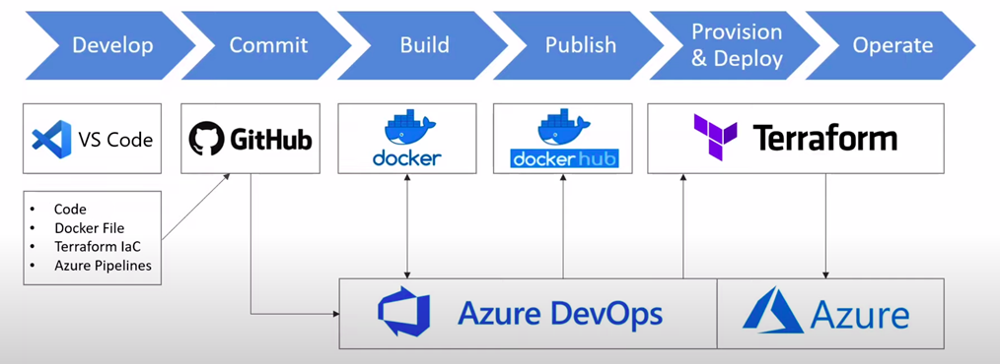

## Set up pipeline no Azure DevOps 

1.0 - Vá para o [Azure DevOps](https://azure.microsoft.com/en-us/services/devops/ "Azure DevOps"), clique em iniciar gratuitamente e
faça logon usando seu email e senha da `FIAP`. Após fazer o login, clique em Novo Projeto.

Forneça o nome e a descrição do seu projeto e escolha a visibilidade.

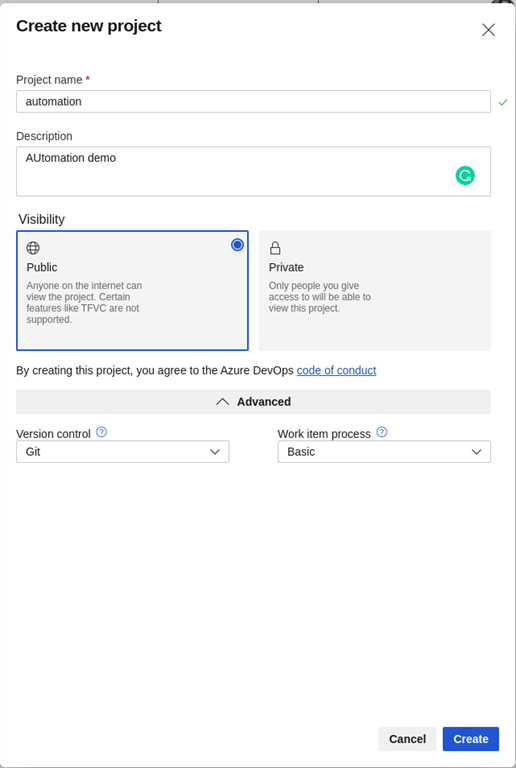

Estamos escolhendo Git como controle de versão, pois tenho meu código no GitHub. Depois de criar o projeto com sucesso, 
você verá a tela abaixo.


Agora siga para `Project Settings`.

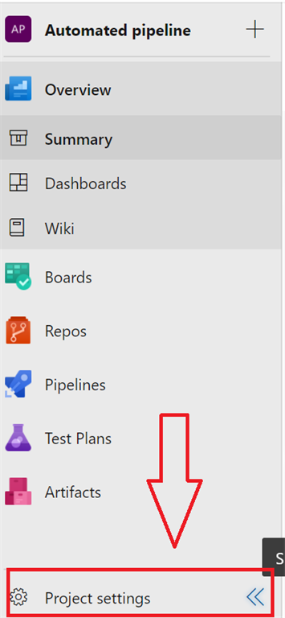

Escolha `Service Connections`.

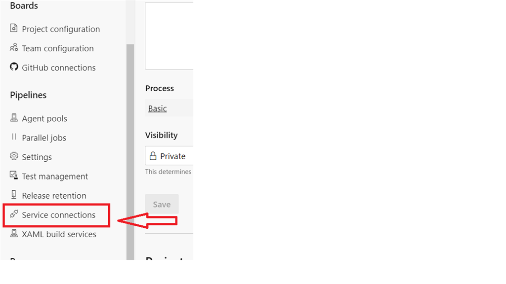

Você pode estar se perguntando por que estamos fazendo isso correto?
Então, o que vamos fazer é criar uma imagem do docker e enviar essa imagem ao hub do docker, portanto, 
precisamos conectar o `Azure DevOps` ao hub(registry) do Docker. 

Agora escolha o `Docker Registry`.

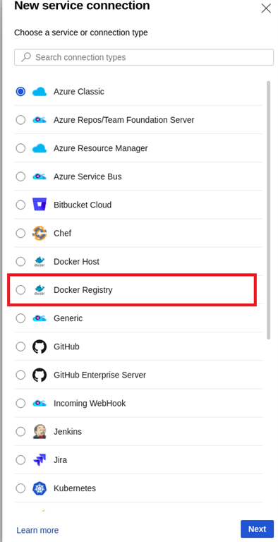

Forneça suas credenciais e em seguida clique em verificar; se verificado, insira o nome do serviço e clique nele.

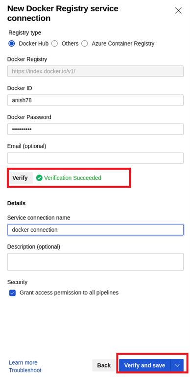

Clique novamente em `New service connection` e clique em `Azure Resource Manager` e finalmente, clique em `Next`.

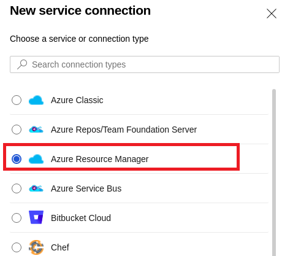

Escolha a opção `service principal automatic`.

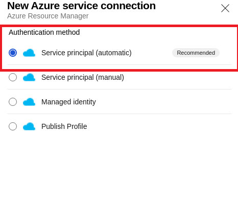

Selecione sua `subscription` e forneça o nome do seu `service connection` e click em `Next`.

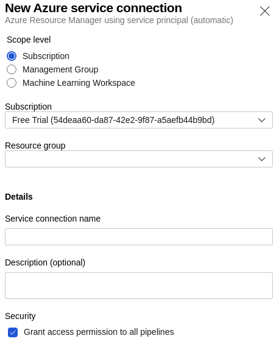

Volte para o `Pipeline` e clique em `Create Pipeline`. Agora escolha Git e entre no GitHub se necessário. 
Depois de entrar, você verá uma lista do seu repositório e precisará escolher o repositório que contém o código da aplicação. 
Pode ser necessário fornecer permissão ao `Azure Pipeline` para acessar seu código.

Com base no código e no arquivo do projeto, ele irá sugerir automaticamente muitas opções para configurar nossa pipeline.
Vamos escolher `Docker` neste caso. 

Clique em `validar` e `configurar`.

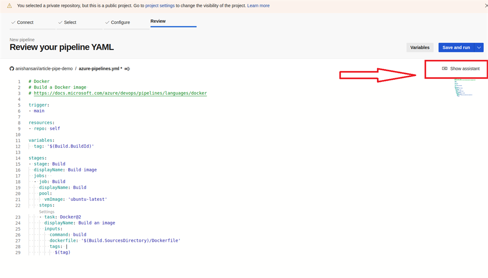

### Docker image

2.0 - Criando automaticamente uma imagem do docker enviando para o docker hub.

Procure na busca `Docker` e escolha a opção `docker`.

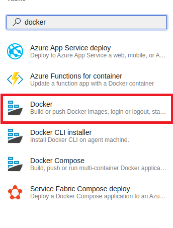

Escolha o registro do docker. 
Já configuramos nossa conexão de serviço para docker, então você deve ver o nome da conexão, 
então escolha a conexão e dê um nome ao repositório do Container. 
Deixe tudo padrão e clique em Adicionar. Isso irá adicionar outra tarefa.

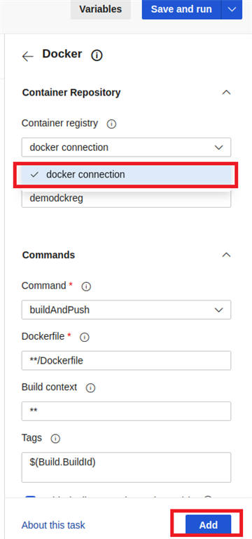

Nossa tarefa anterior apenas cria a imagem do docker, mas não envia para o hub do docker, portanto, 
removeremos ou substituiremos a task atual, pela task que acabamos de criar. 
Seu arquivo YAML deve ser conforme o provisionado neste repositório em: `.github/workflows/dev.workflow.yml`.

Caso esteja criando em um repositório novo, click em `Save and Run`, `Commit directly to the main branch`. 

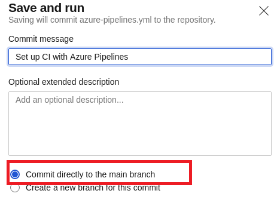

Se você clicar em `Build`, poderá ver o log completo da construção.

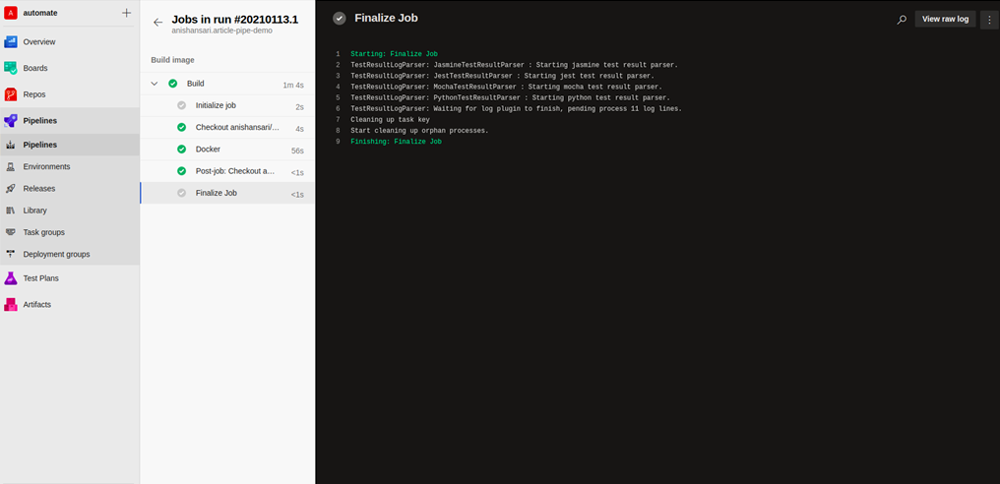

Se a compilação for bem-sucedida e se você acessar o Dockerhub e efetuar login, 
verá uma nova imagem sendo enviada para o seu repositório.

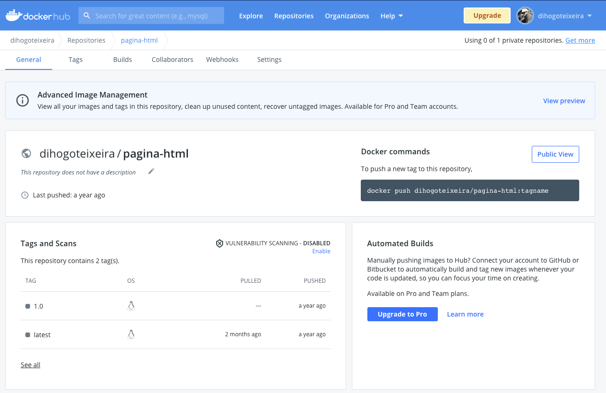


# Set up Terraform para criar resources na Azure e provisionar Docker image

### Então, o que é Terraform?

Terraform é uma infraestrutura de código aberto como uma ferramenta de software de código
que fornece um fluxo de trabalho CLI consistente para gerenciar centenas de serviços em nuvem.
Você pode aprender mais [aqui](https://www.terraform.io/ "aqui").

### O que é infraestrutura como código?

Infraestrutura como código (IaC) é o processo de gerenciamento e provisionamento de 
recursos na nuvem, em vez de fazer login em seu provedor de nuvem e fazer isso manualmente.
Você pode escrever códigos que irão interagir com seu provedor de nuvem e pode criar,
modificar e excluir recursos automaticamente sem visitar o portal.

Como precisamos de um grupo de recursos no Azure Cloud para nossos recursos, 
o código contido em `main.tf` criará um grupo de recursos de domio para: `rg-slashicorp-azure-tf`, 
será necessário alterar para o nome que melhor se enquadra para sua realidade, 
na região de `west-us`.

Lembre-se de realizar o fork e criar as secrets necessárias apontadas no inicio deste `README.md`

Vamos realizar um teste local e validar se está tudo bem e para fazer isso precisamos inicializar
o terraform. para isso instale o binário local seguindo os seguintes passos levando em consideração,
seu sistema operacional [aqui](https://learn.hashicorp.com/tutorials/terraform/install-cli "aqui"). 

Após realizar a instalação, baixe o repositório: 
(usaremos o nosso neste exemplo, em caso de fork copio a URI do seu)

```sh
git clone https://github.com/2TDST-SLASHICORP/devops-application.git
cd devops-application
```

Para iniciar, use o seguinte comando para isso:

```sh
az login
terraform init
```

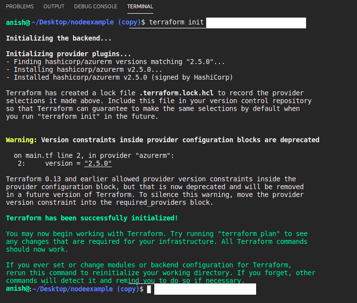

Precisamos fornecer acesso ao terraform para trabalhar remotamente (quero dizer, do pipeline, não da nossa máquina local),
e para fazer isso, vá para o Azure e pesquise o `Azure Active Directory`. 
Clique em `App registration` e clique em `new registration`.

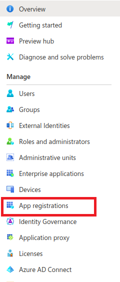

Dê a ele um nome e escolha Contas apenas neste diretório organizacional 
(`Default Directory only - Single-tenant`). 

Clique no `register` e, quando estiver completo, copie o seguinte:

```sh
TENANT_ID = "<azure_subscription_tenant_id>"
CLIENT_ID = "<service_principal_appid>"
```

Acesse `certificates & secrets` e clique em `New client secret`. Dê a ele um nome e copie o valor.

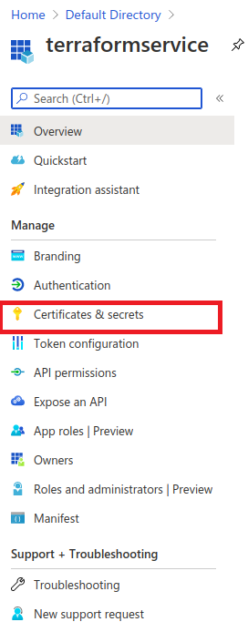

Agora volte para a sua assinatura e copie o ID da assinatura. 
Vá para o pipeline e clique em `Library` para adicionar esses quatro valores para o terraform 
se comunicar com o Azure. Adicione todos os quatro valores aqui como abaixo:

```sh
TF_ARM_SUBSCRIPTION_ID = "<azure_subscription_id>"
TF_ARM_TENANT_ID = "<azure_subscription_tenant_id>"
TF_ARM_CLIENT_ID = "<service_principal_appid>"
TF_ARM_CLIENT_SECRET = "<service_principal_password>"
```

O workflow de CI/CD foi criado de maneira que na branch `dev` o processo de build com Docker é feito
de maneira simples utilizando o web applications com seus resources construidos manualmente.

Caso seja realizado push na branch `main` todos os resources necessários serão criados na AZURE utilizando
Terraform, inclusive a aplicação.

### Tree do repositório

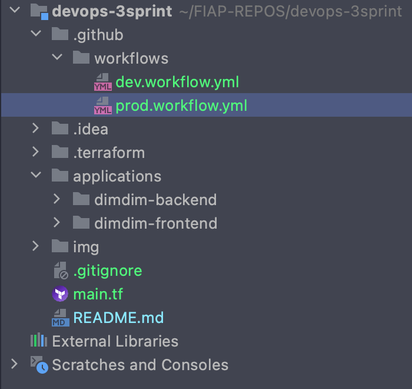

Portanto, agora você não precisa criar sua imagem do docker e enviá-la para o hub do docker. 
Você não precisa criar recursos manualmente. 
Você só precisa se concentrar em seu código e sempre que forçar qualquer alteração, 
ele fará o resto para você. Agora, se tudo estiver concluído, 
você pode ir para o Azure e verificar se a instância do contêiner do Azure está em execução.

# INTEGRANTES

```yaml
Allan Phyllyp Reis (RM85619)
Dihogo Cassimiro Teixeira  (RM84082)
Fernando Borgatto Bouman (RM85833)
Paloma Rangel Rocha (RM86486)
Juan Carlos Benvive Serrano (RM85468)
```
